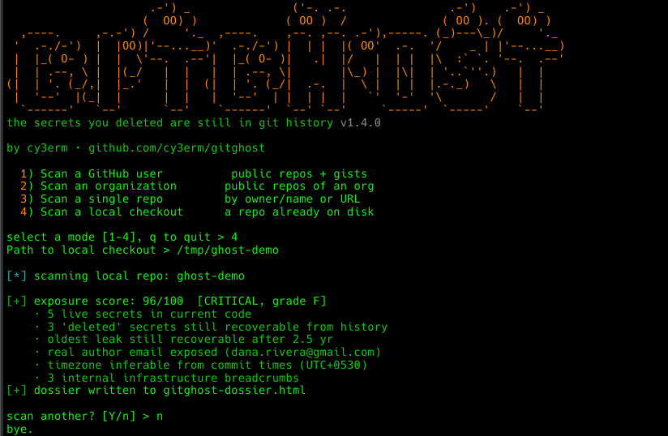

# gitghost

[](https://github.com/cy3erm/gitghost/actions/workflows/ci.yml)




**The secrets you deleted are still in git history.** gitghost finds them.

Finds live credentials in a GitHub account's public repos, *and* the ones that were committed, "deleted," and are still sitting one `git log` away for anyone who clones.

I built this after noticing how often the real leak isn't in someone's current code. It's in a commit from eight months ago that they thought they'd cleaned up. You paste an API key, catch it, delete the line, and move on. The latest version looks fine. But the old commit still has the key, and anyone who clones the repo gets it. Most scanners only look at your current files and miss this entirely. gitghost digs through history for exactly those, then rolls everything into a single **exposure score** so you can tell how bad things are at a glance.

## Highlights

- **Ghost recovery:** walks the full git history of every repo (including unreachable objects) to recover secrets that were removed from HEAD but never purged
- **Force-push recovery:** even if you rewrote history, your recent push events still list the orphaned commit SHAs; gitghost fetches those commits by SHA and scans what the force-push tried to bury
- **Gist revision history:** secrets you edited out of a gist stay readable at old revision URLs; gitghost scans every revision and flags the ones that were "deleted"
- **40+ credential formats:** AWS, GCP, GitHub, OpenAI, Anthropic, Stripe, Slack, Google, Azure, Telegram, Discord, Notion, Shopify, Vault, Postman, Square, and many more (full list below)
- **Generic high-entropy detection:** catches secrets that don't match any known format, with false-positive filtering tuned against real codebases
- **Exposure score (0–100):** one number that weights severity, age of the leak, cross-repo reuse, and whether a "deleted" secret is *still in use* somewhere
- **Metadata leaks:** the author email in your commits, plus inferred timezone and working hours; profile enrichment pulls public name, company, location, blog, and account age
- **HTML dossier output:** every finding links to the exact file+line or commit; findings are shown as irreversible fingerprints so reports are safe to share
- **Interactive console** or one-shot CLI, your choice
- **Zero dependencies:** pure Python 3.10+ standard library

## Install

You need Python 3.10+ and `git`. That's it.

```bash
pipx install gitghost-scanner
gitghost
```

Or run straight from a clone:

```bash
git clone https://github.com/cy3erm/gitghost
cd gitghost
python3 -m gitghost
```

> Set `GITHUB_TOKEN` (any token works, it doesn't need scopes) to raise GitHub's 60-requests/hour anonymous limit before scanning more than an account or two.

## Usage

### Interactive mode

Run gitghost with no arguments and you get a guided launcher: the screen clears, the banner prints, you pick what to scan, type it in, and off it goes.

```
$ gitghost
   ____ _(_) /_____ _/ /_  ____  _____/ /_
  / __ `/ / __/ __ `/ __ \/ __ \/ ___/ __/
 / /_/ / / /_/ /_/ / / / /_/ (__  ) /_
 \__, /_/\__/\__, /_/ /_/\____/____/\__/
/____/      /____/
the secrets you deleted are still in git history v1.3.0
by cy3erm · github.com/cy3erm/gitghost

  1) Scan a GitHub user          public repos + gists
  2) Scan an organization       public repos of an org
  3) Scan a single repo         by owner/name or URL
  4) Scan a local checkout      a repo already on disk

select a mode [1-4], q to quit > 1
GitHub username > octocat

[*] enumerating public repos for @octocat ...
...

[+] exposure score: 29/100  [LOW, grade B]
    · real author email exposed (octocat@nowhere.com)
[+] dossier written to gitghost-dossier.html

scan another? [Y/n] >
```

### One-shot CLI

Interactive mode covers the common cases; every option also has a flag for scripting:

```bash
gitghost <username>                 # audit a user's public repos (+ gists)
gitghost <username> --limit 50      # cap repos per identity
gitghost <username> --network       # also crawl followers/following
gitghost --org acme                 # scan an org's public repos
gitghost --org acme --members       # ...plus every public member's repos
gitghost --repo owner/name          # one repo by URL or owner/name
gitghost --local ./my-checkout      # scan a checkout already on disk
gitghost --out report.html          # where to write the dossier
gitghost --no-gists                 # skip gist scanning
gitghost --jobs 8                   # parallel clones/scans (default 4)
gitghost --debug                    # full traceback if something breaks
```

Try the demo first if you'd rather not point this at a real person. It builds a tiny repo with fake credentials, including one that gets "deleted" a few commits in:

```bash
bash demo/make_demo_repo.sh /tmp/demo
gitghost --local /tmp/demo --name demo
```

Watch it recover the deleted key from history.

## What it detects

**Cloud & infrastructure**
AWS access keys and secret keys · GCP service-account keys · Azure storage keys · database connection strings (Postgres, MySQL, MongoDB, Redis) · private key blocks (RSA/EC/OpenSSH/DSA/PGP) · HashiCorp Vault tokens · internal hostnames and private IPs

**Developer platforms**
GitHub PATs (classic + fine-grained) and OAuth tokens · GitLab PATs · npm publish tokens · PyPI upload tokens · Postman API keys · Sentry auth tokens · Netlify tokens · Linear API keys · Figma tokens · PlanetScale service tokens

**AI services**
OpenAI (classic + project keys) · Anthropic · Groq · Perplexity · xAI · Hugging Face · Replicate

**Communication & SaaS**
Slack (tokens, webhooks, app tokens) · Discord (webhooks, bot tokens) · Telegram bot tokens · Twilio · SendGrid · Mailgun · Notion integration secrets · Shopify · Square · Razorpay · DigitalOcean · Doppler · Firebase Cloud Messaging server keys · Google API keys and OAuth refresh tokens

**Everything else**: a generic high-entropy scanner looks for values assigned to suspiciously-named variables (`api_key = "..."`) even when no provider pattern matches, filtered through placeholder/entropy checks to keep false positives near zero.

Missing a provider you care about? Rules are four lines each in [`gitghost/rules.py`](gitghost/rules.py): name, regex, severity, remediation advice. PRs welcome.

## The score

One number, 0–100, higher is worse:

- **Severity-weighted findings:** a live AWS secret key counts far more than a webhook URL
- **Ghost weighting:** recovered-from-history secrets scale with age: something exposed for 2 years hurts more than something from last week
- **Reuse correlation:** the same secret across multiple repos, and the nastiest case: a "deleted" secret whose fingerprint still matches something *live*
- **Metadata exposure:** real email in commits, inferable timezone

A single live cloud key is enough to put an account in the red by itself. Run it, clean up, run again, and the number tells you if it worked.

## Where it draws the line (legal & ethics)

It only ever reads public repositories (things the account already chose to publish), and it's detection-only. It'll tell you a string *looks like* a credential and leave it at that. It won't try the key against the actual service to see if it still works, because quietly logging into someone else's account isn't the tool's job, and honestly it's not yours either. Use it on your own identity, or one you're authorized to assess.

Findings are shown as non-reversible fingerprints (a safe prefix, a length, a partial hash), never recoverable key material, so reports are safe to share. gitghost does not retain raw secrets past the match.

Point it at yourself first. Most people turn up at least one thing they'd completely forgotten about. I did.

## Leaked something? The fix is rotate, not delete.

Deleting the file or the repo doesn't un-leak anything: anyone who cloned already has the key. Rotate the credential first, then purge history with `git filter-repo`. The end of every dossier walks through both steps.

## Development

```bash
python -m pytest tests        # detection engine tests
pip install pyflakes && python -m pyflakes gitghost   # lint
```

CI runs the suite on Python 3.10, 3.11, and 3.12.

## License

MIT
